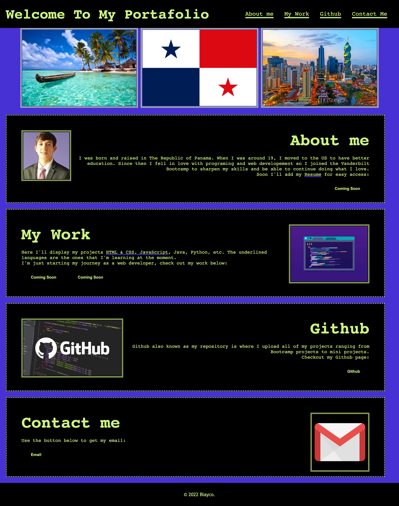

# My Portfolio

This is my first project in which I get to demonstrate, what I have learned this past couple of weeks in HTML and CSS. I created a personal portfolio that talks a little about me and where I'm from, my projects and future projects, Github with my repositories and a form of Contact with me.

# Screenshot

# URL for website

[Here is the link to the website](https://jblay10.github.io/myPortfolio/Index.html#)